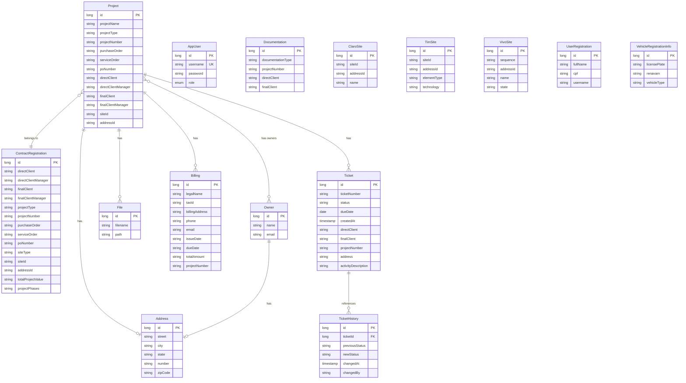

# Project Hub - Entity Relationship Diagram

This document describes the JPA entity relationships in the Project Hub service.

## Mermaid ER Diagram

## Relationship Summary

| From | To | Type | Description |
|------|-----|------|-------------|
| Project | Address | One-to-One | Project has one address |
| Project | ContractRegistration | Many-to-One | Projects reference a contract |
| Project | Owner | Many-to-Many | Projects have many owners (via `owner_project` join table) |
| Project | File | One-to-Many | Project has many files |
| Project | Billing | One-to-Many | Project has many billings |
| Project | Ticket | One-to-Many | Project has many tickets |
| Owner | Address | One-to-One | Owner has one address |
| Ticket | TicketHistory | One-to-Many | Ticket status changes (via `ticketId` reference) |

## Standalone Entities

The following entities have no JPA relationships to other domain entities:

- **AppUser** – User authentication (role is an enum, not a separate entity)
- **Documentation** – Documentation records (reference fields are strings, not FKs)
- **ClaroSite** – Site lookup data
- **TimSite** – Site lookup data  
- **VivoSite** – Site lookup data
- **UserRegistration** – User/HR registration data
- **VehicleRegistrationInfo** – Vehicle fleet data

## Notes

- **Address** can be associated with either an **Owner** or a **Project** (via `address_id` on the owning side).
- **TicketHistory** references **Ticket** via `ticketId` (Long) rather than a JPA `@ManyToOne`; it is a logical relationship.
- **owner_project** is the join table for the Project ↔ Owner many-to-many relationship.
