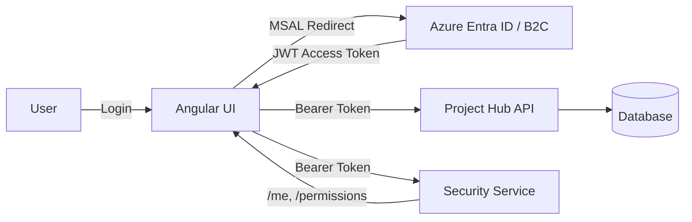
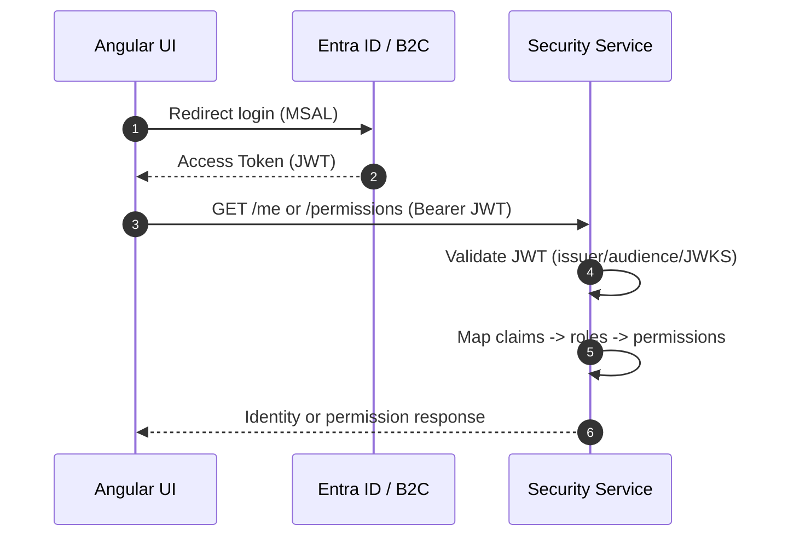
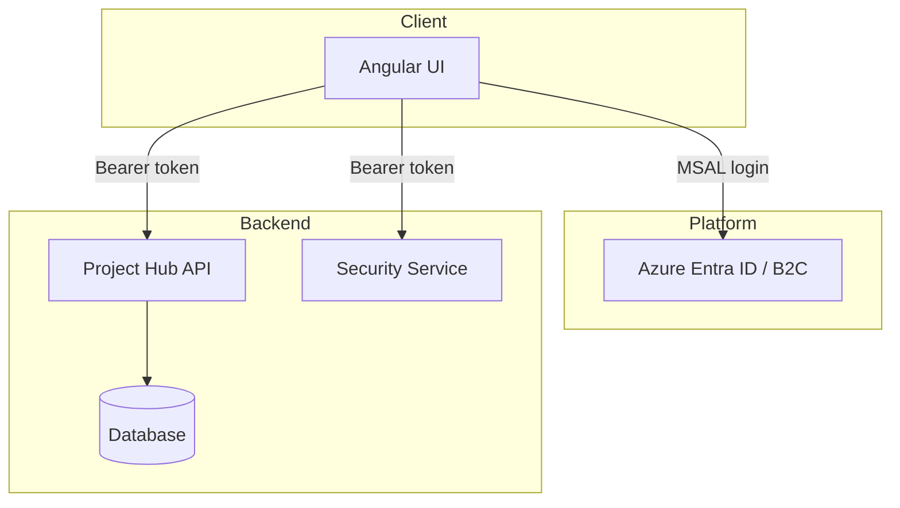
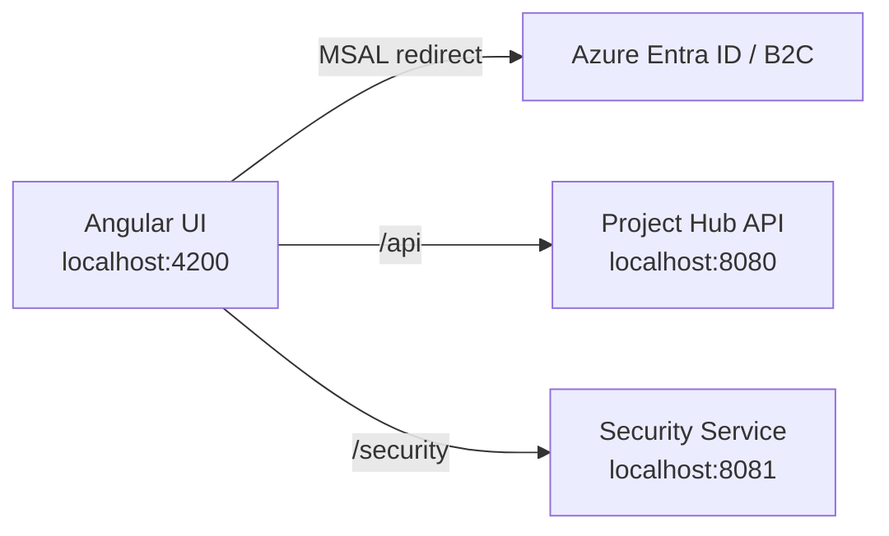

# Security Service

This service provides centralized authorization policy and identity/claims mapping for a
microservices ecosystem. It integrates with a managed Identity Provider (Azure Entra ID / B2C)
and exposes authorization-friendly endpoints for clients and services.

## Why OAuth2 + OIDC

- **OAuth2 + OIDC** is the modern standard for web, mobile, terminal, and service clients.
- **Authorization Code + PKCE** is the safest interactive flow for browser and mobile apps.
- **Client Credentials** is the standard for service-to-service calls.
- **On-Behalf-Of (OBO)** supports downstream service calls using the user context.
- **JWT access tokens** allow resource servers to validate tokens locally with JWKS.

## Core Responsibilities

- Map IdP claims to internal roles/permissions.
- Provide centralized permission evaluation and optional policy decisions.
- Offer a consistent identity endpoint for internal clients and audit needs.

## Endpoints

- `GET /me` - returns the current authenticated principal and claims.
- `GET /permissions` - returns permission set derived from claims + mapping.

## Local Run

```powershell
.\mvnw.cmd spring-boot:run
```

## Configuration

Set your IdP issuer and audience in `application.yml`:

```yaml
spring:
  security:
    oauth2:
      resourceserver:
        jwt:
          issuer-uri: https://login.microsoftonline.com/{tenant}/v2.0
          audiences: api://security-service
```

## Notes

- For Azure Entra ID / B2C, prefer MSAL on clients.
- Protect secrets with Azure Key Vault in production.

## MSAL Deep Class

### What MSAL Is

MSAL (Microsoft Authentication Library) is a **client-side authentication SDK** provided by
Microsoft to obtain tokens from Azure Entra ID (formerly Azure AD) and Azure AD B2C. It
implements OAuth 2.0 and OpenID Connect flows and manages token acquisition, caching, and
renewal for client applications (SPA, mobile, desktop, and server-side apps).

MSAL is not a protocol. It is a library that **implements** OAuth2/OIDC flows and exposes a
consistent API so apps can sign users in and call protected resources.

### Core Concepts

**Accounts and Sessions**
- MSAL stores signed-in accounts in a cache. An account represents a user identity in a
  specific tenant and is the basis for token acquisition.

**Tokens**
- **ID Token** (OIDC): proves who the user is.
- **Access Token** (OAuth2): allows calling protected APIs.
- **Refresh Token** (OAuth2): lets the client obtain new access tokens without re‑prompting.

**Scopes and Resources**
- Scopes represent permissions. Examples: `openid`, `profile`, `email`,
  `api://project-hub/.default`.

**Authority, Tenant, Client ID**
- **Authority**: issuer URL (tenant endpoint).
- **Tenant**: directory or B2C policy scope.
- **Client ID**: app registration ID in Entra ID.

**Cache and Silent Acquisition**
- MSAL tries silent acquisition first and only prompts the user when necessary.

### Is MSAL Similar to OAuth2?

**MSAL is not a protocol. OAuth2 is a protocol.**

MSAL implements OAuth2 + OIDC flows (Authorization Code + PKCE, Client Credentials, OBO),
but it is **not** OAuth2 itself. It is the SDK that helps you execute those flows correctly
on Microsoft identity platforms.

### Differences: MSAL vs OAuth2

- **Type**: OAuth2 is a spec; MSAL is an SDK.
- **Scope**: OAuth2 defines token exchange; MSAL provides APIs for login, caching, renewal.
- **IdP Specifics**: OAuth2 is IdP-agnostic; MSAL is optimized for Microsoft identity.
- **Token Cache**: OAuth2 is silent on caching; MSAL includes cache and session handling.
- **B2C Policies**: MSAL supports Azure AD B2C policy patterns out of the box.

### Typical SPA Flow (Angular)

1. User clicks **Sign in**.
2. MSAL redirects to the IdP.
3. IdP authenticates and returns tokens.
4. MSAL stores tokens and user account in cache.
5. HTTP interceptor attaches access tokens to API requests.
6. Tokens are silently refreshed when they expire.

## Diagrams

### 1) Overall Authentication and Authorization Flow



### 2) Token Usage in the Security Service



### 3) Component Diagram



### 4) Deployment View (Local Dev)



## Workspace Context (How MSAL Applies Here)

### Angular Project Hub (Frontend)

- Uses MSAL redirect flow.
- Configures protected resources for `/api` and `/security`.
- MSAL interceptor attaches tokens for both APIs.

### Security Service (Backend)

This service is a **resource server**. It validates access tokens generated by the IdP
(the same tokens MSAL acquires). It does not use MSAL directly, but it depends on the tokens
produced by MSAL flows on the client side.

## More Reading

- `architecture.md`
- `explanation.md`
