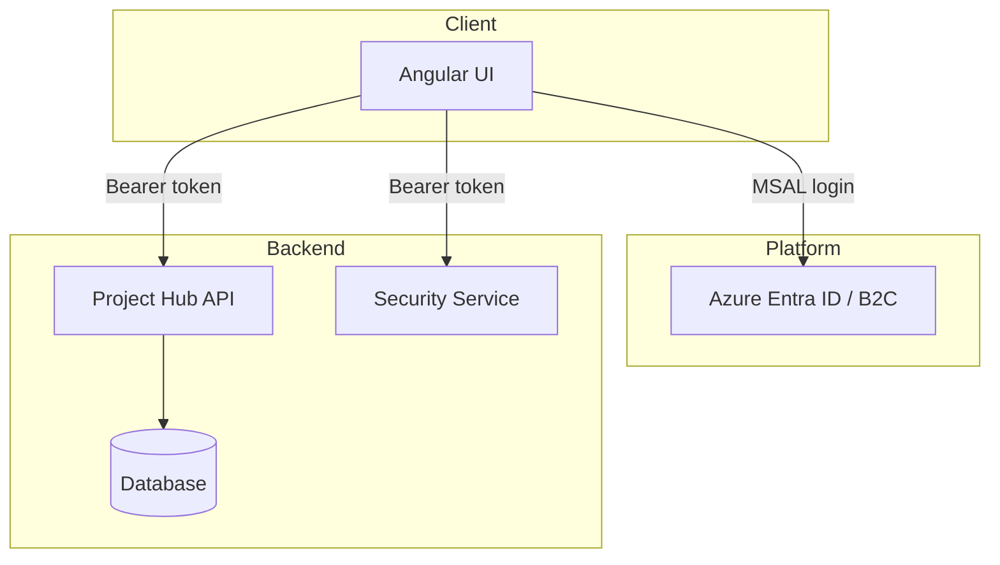
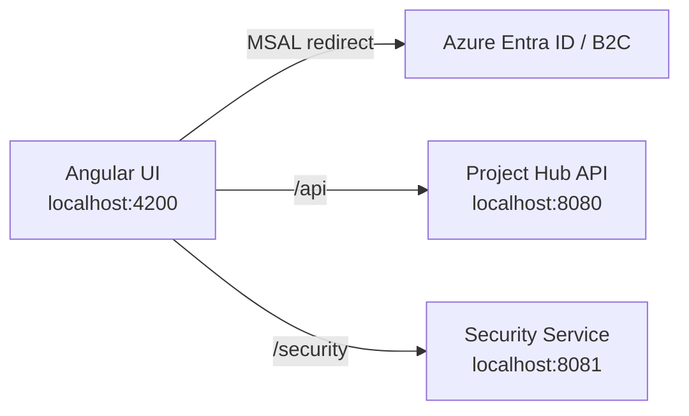

# Architecture - Security Service

## 1) System Context

This service is the **authorization and identity adapter** in the Project Hub ecosystem.
It integrates with the Identity Provider (Azure Entra ID / B2C) and provides normalized
identity and permission data to clients and services.

```
User/Client
  |
  | 1) Authenticate with IdP (Azure Entra ID/B2C)
  v
Identity Provider  --->  JWT Access Token
  |
  | 2) Call Security Service with Bearer token
  v
Security Service  --->  /me + /permissions
```

## 2) Logical Architecture

- **Security Configuration**
  - Validates JWT tokens using issuer/audience
  - Applies stateless authentication and request authorization

- **Claims Mapping**
  - Converts IdP claims (roles, groups, scopes) into Spring authorities
  - Uses configurable group-to-role mappings

- **Permission Resolution**
  - Maps roles to application permissions
  - Returns consistent permission sets for clients

- **API Layer**
  - `/me`: identity introspection endpoint
  - `/permissions`: authorization decision helper

## 3) Integration Points

- **Angular Frontend**
  - Calls `/security/me` and `/security/permissions`
  - MSAL attaches access tokens for `api://security-service/.default`

- **Project Hub Backend**
  - No direct call in current code
  - Can integrate by calling `/permissions` for centralized authorization decisions

## 4) Deployment View

Typical local/dev ports:

- Security Service: `http://localhost:8081`
- Project Hub API: `http://localhost:8080`
- Angular UI: `http://localhost:4200`

## 5) Key Source Files

- `src/main/java/pexper/projects/security_service/config/SecurityConfig.java`
- `src/main/java/pexper/projects/security_service/security/JwtAuthoritiesConverter.java`
- `src/main/java/pexper/projects/security_service/services/PermissionService.java`
- `src/main/java/pexper/projects/security_service/controllers/IdentityController.java`

## 6) Full Ecosystem Integration (All Projects)

This view shows how the three repositories integrate at runtime.

```
User
  |
  | (A) Login with IdP (Azure Entra ID / B2C)
  v
Identity Provider  --->  JWT Access Token
  |
  | (B) UI calls APIs with Bearer token
  v
Angular UI
  |----> /api/**         (Project Hub API, port 8080)
  |
  +----> /security/**    (Security Service, port 8081)
```

### Data and Authorization Flow

1. The user authenticates with the IdP and receives a JWT.
2. The Angular UI attaches the token via MSAL interceptor.
3. The UI calls:
   - Project Hub for CRUD operations and domain data.
   - Security Service for identity and permissions.
4. Project Hub validates JWTs for `/api/**` and enforces backend security.
5. Security Service validates JWTs and returns normalized identity/permissions.

This keeps identity and authorization logic centralized while the Project Hub API focuses
on business data and CRUD operations.

## 7) Diagrams

### 7.1 Component Diagram



### 7.2 Deployment View (Local Dev)


